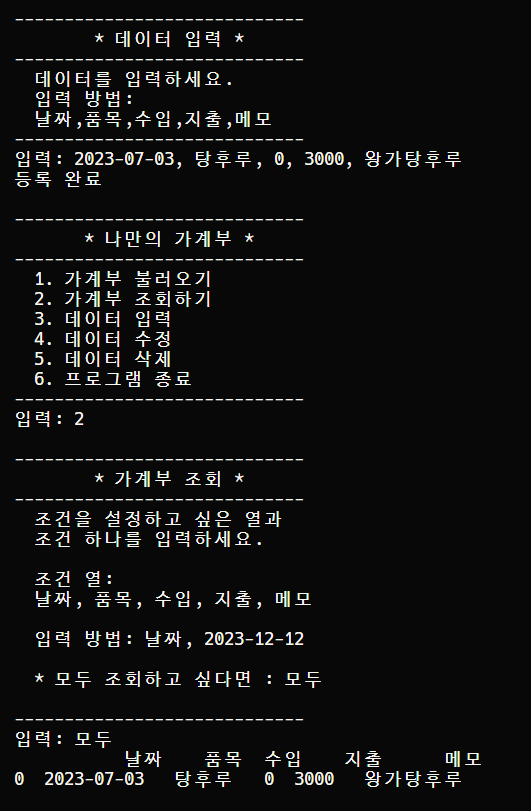
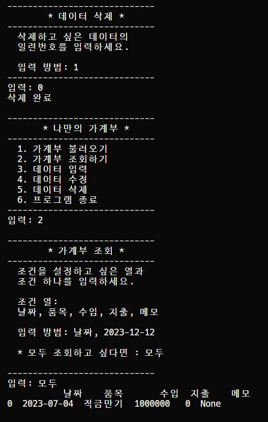
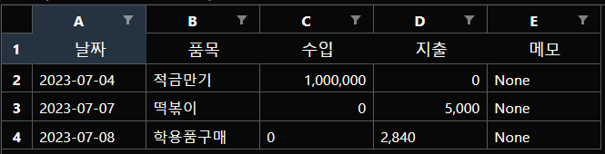

# 📕 나만의 가계부 직접 구현하기
- KDT-4기 1번째 미니 프로젝트(개인)

---
## 💻 Description

"파이썬을 접한지 3주차, 이제는 **나만의 가계부**를 만들어 쓰고 싶다." 
객체 지향 언어의 작동 구조를 체득하기 위해 기획한 프로젝트입니다.  
엑셀 파일로 가계부를 저장하며, 명령 프롬프트에서 데이터를 입출력/변경/삭제합니다.  

- 클래스의 생성자 메서드를 통한 인스턴스 생성
- 클래스 내 메서드를 활용하여 기능 구현
- 클래스 상속을 통한 코드 공유
- 기능에 따른 모듈 분리

---
## ⏱ Project Duration

- **개발을 위한 공부:** 2023.06.19. ~ 2023.07.07.
- **실제 개발 기간:** 2023.07.05. ~ 2023.07.07.

---
## ⚙ Environment / Prerequisite

- Python (Version 3.9.0 / Window)
- **Framework:** pandas
- **IDE:** Visual Studio Code

---
## 📁 Folders / Files

1) `Accounts_module.py`
    - 가계부 클래스와 데이터 클래스를 통해 인스턴스를 생성합니다.
    - 클래스의 메서드를 통해 기능을 구현합니다.

2) `view.py`
    - 명령 프롬프트에서 가계부를 확인하기 위한 출력 데이터를 저장합니다.

2) `main.py`
    - 프로그램 실행 파일입니다.

---
## 🔎 Usage Example
- 명령 프롬프트를 통해 데이터를 관리합니다.  
<table>
<tr>
<td>

</td>
<td>

</td>
</tr>
</table> 

- excel 파일에 변경 내용을 저장합니다.  

