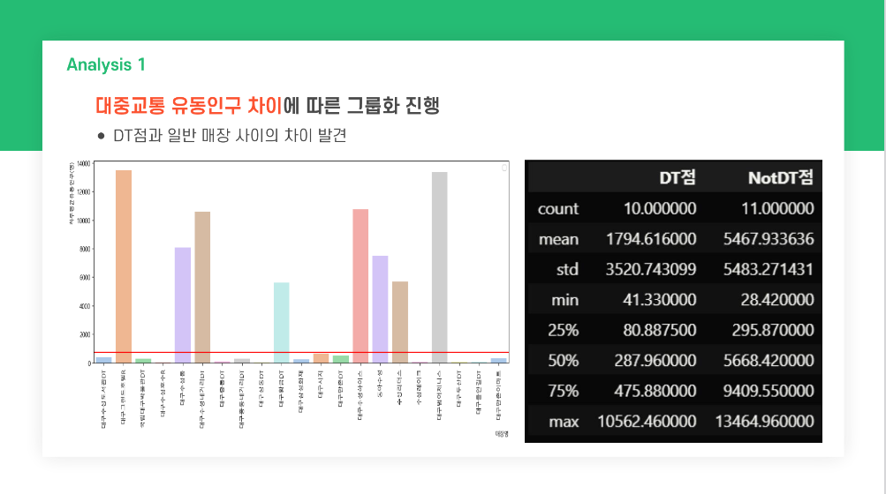
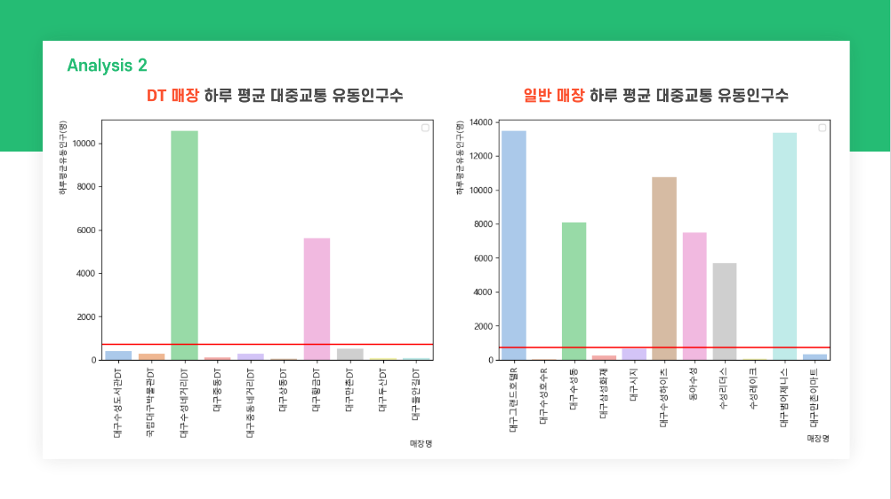
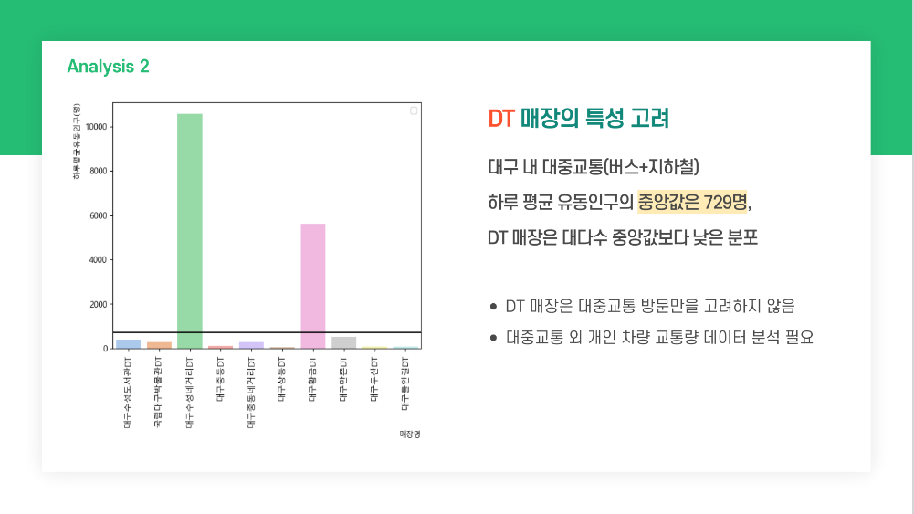
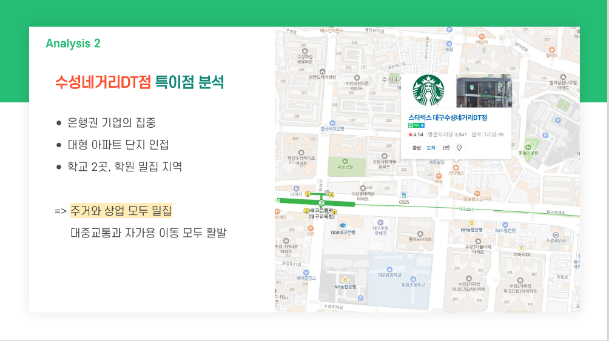
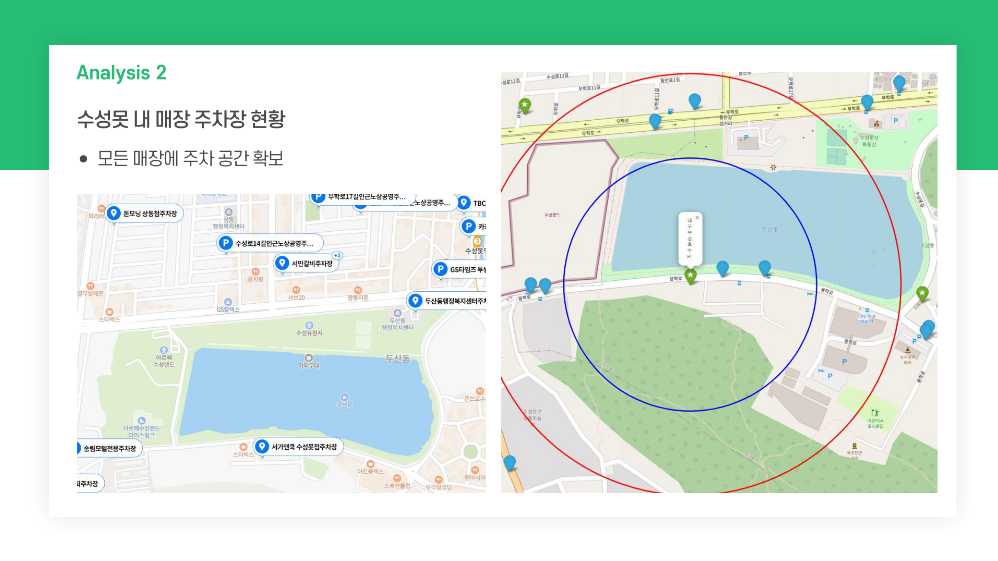

# 💚☕ 데이터 기반 스타벅스 최적 입지 선정
- KDT-4기 2번째 미니 프로젝트(4인 그룹)

---
## 💻 Description

상권 분석을 철저히 하기로 유명한 스타벅스, **어떤 조건의 입지에 진입**할까요? 
유동인구(버스, 지하철)와 정주인구, 상권 등 여러 요건과의 상관관계를 분석한 후 
대구 내 새롭게 입점하면 좋을 최적 입지를 추천합니다.  

- 활용 데이터:
    - 2021, 2022년 대구 스타벅스 매장 입점지 데이터
    - 2021, 2022년 대구 지하철, 버스 승하차 데이터  
    - 2021, 2022년 대구 아파트 현황 데이터  

- '수성구' 지역 스타벅스 입지 분석 
- 스타벅스 입점 전후의 상권과 유동인구를 비교 
- 스타벅스 매장, 지하철역/버스 정류장의 좌표를 추가하여 지도 상에 표현 
- 새로운 매장의 최적 입점지 추천  

---
## ⏱ Project Duration

- **개발을 위한 공부:** 2023.07.10. ~ 2023.07.21.
- **실제 개발 기간:** 2023.07.13. ~ 2023.07.21.

---
## ⚙ Environment / Prerequisite

- Python (Version 3.9.0 / Window)
- **Framework:** Pandas, Matplotlib, seaborn, folium ...
- **IDE:** Visual Studio Code

---
## 📁 Folders / Files

1) `make_total_file.py`
    - 여러 개로 분리된 데이터를 하나로 통합합니다.

2) `plot.ipynb`, `plot_store.ipynb`, `plot_car.ipynb`, `plot_bus.ipynb`
    - 입지에 영향을 미치는 각 요소에 대한 세부 그래프를 출력합니다.
    - 실제 그래프 출력 예시를 파일 내에서 확인할 수 있습니다.

3) `map.ipynb`
    - 스타벅스 매장 기준 특정 거리 내에 위치하는 요소를 지도 상에 표기합니다.

---
## 🔎 Usage Example

