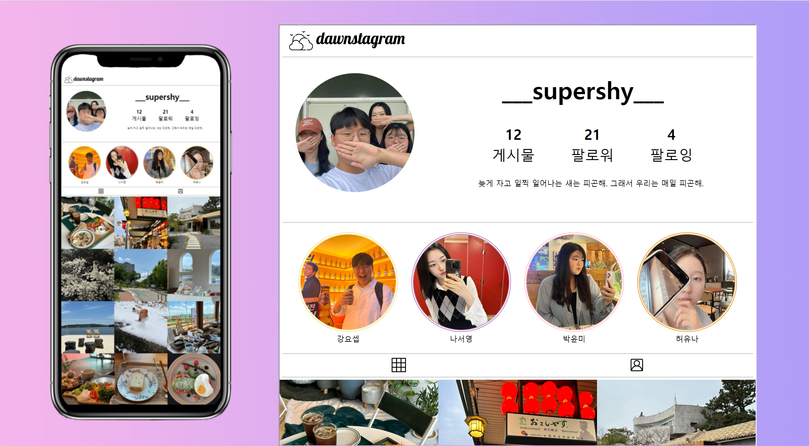
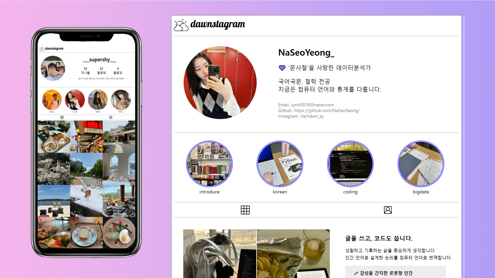
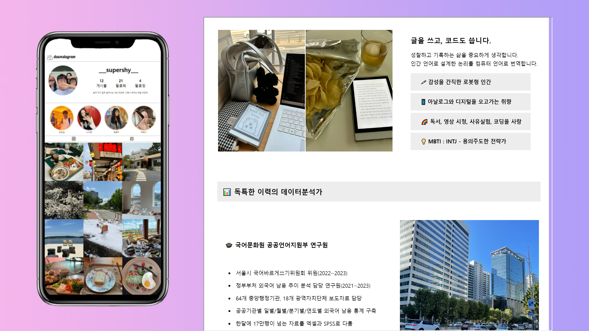

# 🎀 인스타그램 클론 코딩을 통한 포트폴리오 제작
- KDT-4기 3번째 미니 프로젝트(4인 그룹)

---
## 💻 Description

인스타그램의 개인 프로필 기능과 UI를 모방하여 
개인 포트폴리오를 HTML, CSS를 활용하여 제작하였습니다.   

- HTML, CSS를 활용한 웹 페이지 디자인
- Iframe을 활용하여 모바일 구성으로 화면 배치

---
## ⏱ Project Duration

- **개발을 위한 공부:** 2023.07.24. ~ 2023.07.28.
- **실제 개발 기간:** 2023.07.27. ~ 2023.07.28.

---
## ⚙ Environment / Prerequisite

- HTML, CSS
- **IDE:** Visual Studio Code

---
## 📁 Folders / Files

1) team_page / `outer.html`
    - root가 되는 html 파일입니다.
    - 해당 문서에서 시작하여 모든 파일이 이어집니다.

2) 나서영 / `introduce_서영.html`, `introduce_서영.css`
    - 개인 포트폴리오 페이지 디자인 파일입니다.

---
## 🔎 Usage Example
- 팀원 소개 페이지를 통해 개인 포트폴리오 페이지로 접근합니다.  
  

- HTML, CSS를 활용하여 포트폴리오 페이지를 제작하였습니다. 
- Iframe을 활용하여 화면을 구성하였습니다. 
<table>
<tr>
<td>

</td>
<td>

</td>
</tr>
</table> 