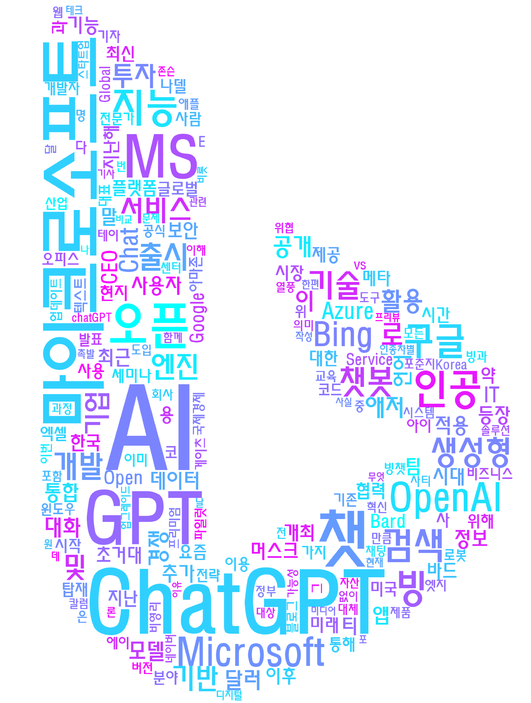
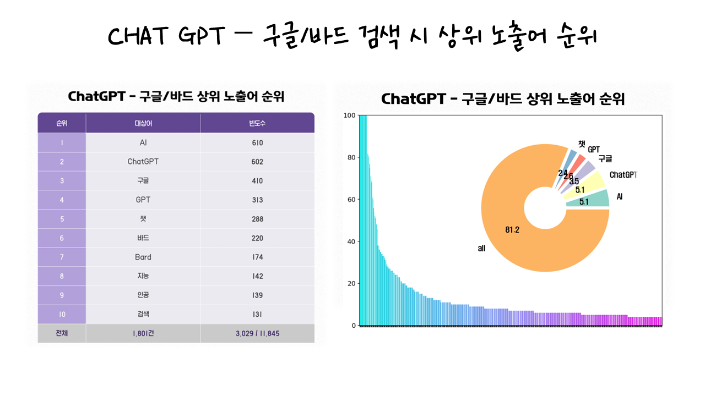
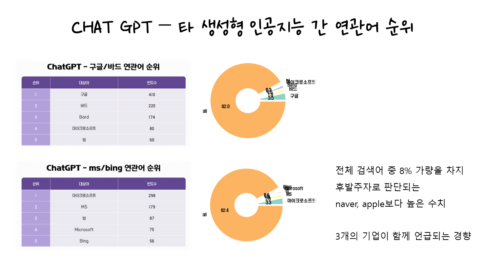
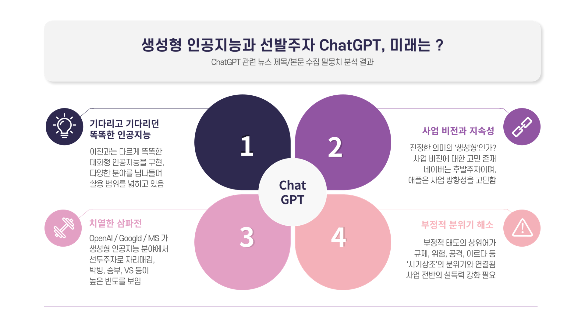

# 🔎 크롤링을 통한 ChatGPT 연관 키워드 분석
- KDT-4기 4번째 미니 프로젝트(4인 그룹)

---
## 💻 Description

구글에서 ChatGPT 관련 포스팅을 크롤링하여 
경쟁사 반응 키워드 분석, 감정 분석 등을 실시하여 산업 동향을 살폈습니다.  

- 구글 페이지 크롤링을 통한 데이터 구축
- 불용어 처리 등 자연어 처리를 거친 키워드 분석
- 의미 단위의 감정 라벨링을 통한 감정 분석

---
## ⏱ Project Duration

- **개발을 위한 공부:** 2023.07.24. ~ 2023.08.04.
- **실제 개발 기간:** 2023.08.03. ~ 2023.08.04.

---
## ⚙ Environment / Prerequisite

- Python (Version 3.9.0 / Window)
- **Framework:** Konlpy, Wordcloud, Pandas, Request, BeautifulSoup...
- **IDE:** Visual Studio Code

---
## 📁 Folders / Files

1) `main.py`
    - 구글 페이지의 크롤링 담당 클래스를 구현합니다.
    - 자연어 품사 태깅과 의미 단위 파싱, 불용어 처리와 워드클라우드 제작 클래스를 구현합니다.

---
## 🔎 Usage Example
- 키워드 시각화를 위한 워드클라우드 생성 
<table>
<tr>
<td>

</td>
<td>

</td>
</tr>
</table>

- 키워드 상위 노출어 분석을 통한 분석 결과 도출 
<table>
<tr>
<td>

</td>
<td>

</td>
</tr>
</table>

