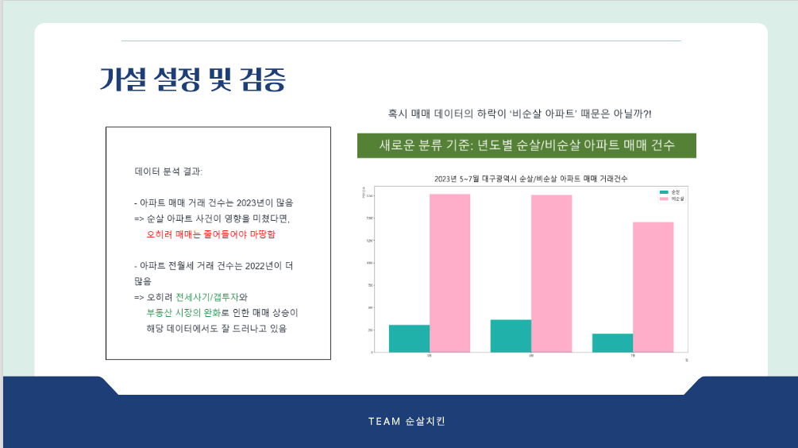
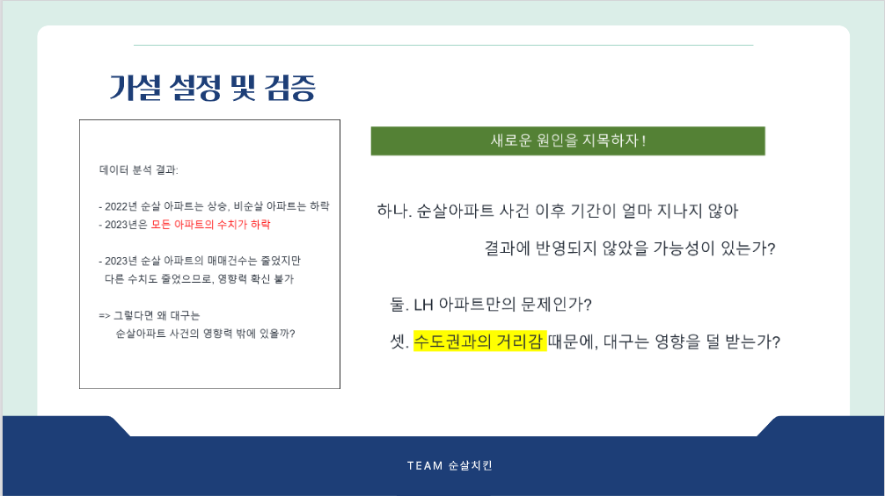
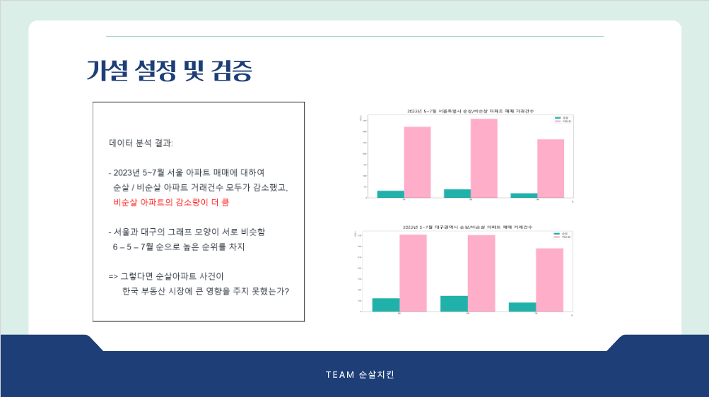
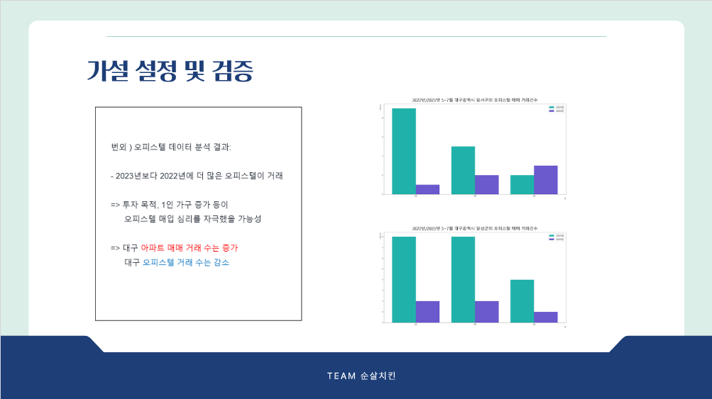

# 🏙 순살 아파트 이슈로 인한 대구 부동산 동향 분석
- KDT-4기 5번째 미니 프로젝트(4인 그룹)

---
## 💻 Description

대한민국을 뒤흔든 '순살 아파트' 사건, 대구 부동산 동향에도 영향을 미쳤을까요?  
공공데이터를 활용하여 아파트, 오피스텔의 매매/전세/월세 거래 동향을 분석합니다.  

- 국토교통부 아파트/오피스텔 실거래가 데이터 활용
- 순살아파트 사건 공론화 이전과 이후의 대구광역시 구별 부동산 거래건수 분석

---
## ⏱ Project Duration

- **개발을 위한 공부:** 2023.08.07. ~ 2023.08.11.
- **실제 개발 기간:** 2023.08.09. ~ 2023.08.11.

---
## ⚙ Environment / Prerequisite

- Python (Version 3.9.0 / Window)
- **Framework:** Pandas, Matplotlib...
- **IDE:** Visual Studio Code

---
## 📁 Folders / Files

1) `main.py`
    - 데이터 가공 클래스, 그래프 시각화 클래스를 구현합니다.
    - 파일명과 다양한 매개변수를 입력하여 시각화 결과를 출력할 수 있습니다.

1) graph/ `2022`, `2023`, `all`, `compare`
    - 실제 코드를 통해 추출한 그래프를 보여줍니다.

        - 2022, 2023: 연도별 5~7월의 대구광역시 구벌 부동산 거래 건수 그래프
        - all: 대구광역시/서울특별시 연도별 5~7월의 부동산 거래 건수 그래프
        - compare: 대구광역시 구별 2022/2023년 부동산 거래 건수 비교 그래프

---
## 🔎 Usage Example

