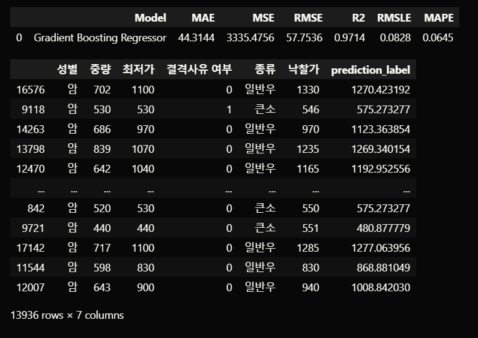
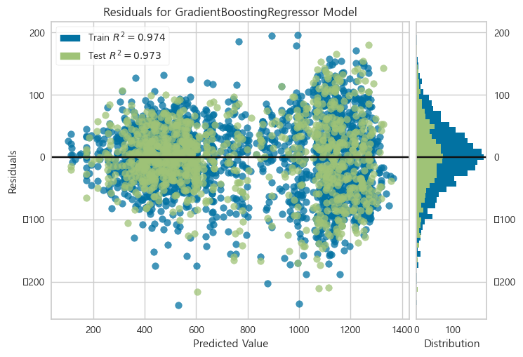

# 🍖 초보 농가를 위한 한우 가격 낙찰가 예측 서비스
- KDT-4기 6번째 미니 프로젝트(5인 그룹)

---
## 💻 Description

갑작스러운 한우 가격 하락으로, 미처 대응책을 준비하지 못한 초보 농가에 큰 피해가 발생하였습니다. 
한우 가격 데이터를 활용하여 판매 가격 예측 서비스를 구현하였습니다.  

- 스마트한우경매사이트의 한우 거래 데이터 활용
- 특성공학, 머신러닝 GradientBoosting Regression을 통한 한우 가격 예측 회귀 모델링

---
## ⏱ Project Duration

- **개발을 위한 공부:** 2023.08.28. ~ 2023.09.01.
- **실제 개발 기간:** 2023.08.31. ~ 2023.09.01.

---
## ⚙ Environment / Prerequisite

- Python (Version 3.9.0 / Window)
- **Framework:** Scikit-Learn, Pycaret, pandas, matplotlib...
- **IDE:** Visual Studio Code

---
## 📁 Folders / Files

1) `main.ipynb`
    - 주요 피처 추출을 위한 특성공학과 모델링 과정 전반을 보여줍니다.
    - 구현 모델:
        - scikit-learn RandomForest Regression
        - pycaret GradientBoosting Regression

---
## 🔎 Usage Example

