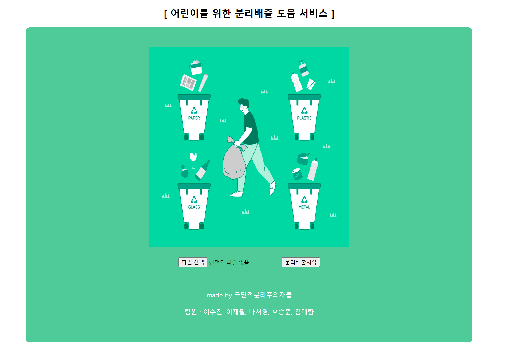
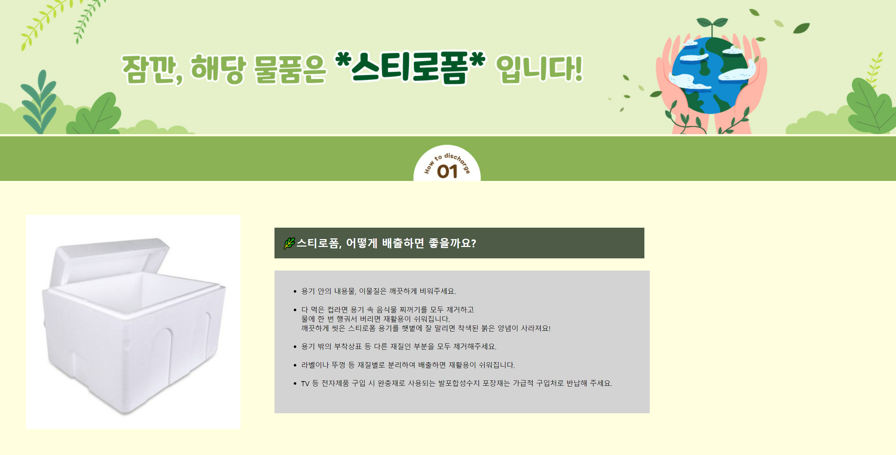

# ♻ 재활용품 이미지 분류 서비스
- KDT-4기 7번째 미니 프로젝트(5인 그룹)

---
## 💻 Description

재활용품, 카메라에 비추면 어떻게 배출해야 하는지 알려주는 프로그램 없나? 
이미지 인식을 통해 캔/유리/종이/플라스틱/스티로폼으로 분류합니다.  

- 직접 촬영한 재활용품 이미지를 활용, 이미지 증폭을 통한 데이터 다양화
- 머신러닝 RandomForest 앙상블로 이미지 다중 분류 모델링
- 모델 실제 사용을 위한 웹 서비스 구현

---
## ⏱ Project Duration

- **개발을 위한 공부:** 2023.08.28. ~ 2023.09.22.
- **실제 개발 기간:** 2023.09.20. ~ 2023.09.22.

---
## ⚙ Environment / Prerequisite

- Python (Version 3.9.0 / Window)
- **Framework:** Scikit-learn, Pycaret, Opencv, Flask...
- **IDE:** Visual Studio Code

---
## 📁 Folders / Files

1) App / `main.py`
    - Web 서비스 실행 파일입니다.
    - 모델을 통한 예측 결과 라우팅을 담당합니다.

2) App / make_model 
    - 모델 구현과 관련된 코드를 확인하실 수 있습니다.
    - `Image_amplification.py` 이미지 증폭 함수를 구현합니다.
    - `make_model.py` 모델링 함수를 구현합니다.

---
## 🔎 Usage Example
- 재활용품 이미지를 업로드하여 결과를 확인합니다.  
  

- 해당 재활용품에 대한 설명과 분리배출 방법 안내 페이지로 이동합니다.  

