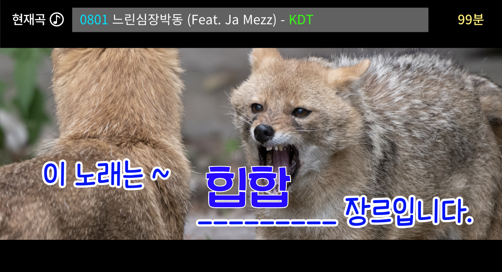

# 🎹 음악 가사 분석을 통한 장르 분류 서비스
- KDT-4기 9번째 미니 프로젝트(4인 그룹)

---
## 💻 Description

내가 쓴 가사, 어떤 장르 음악에 어울릴까요? 
**음악 가사**를 입력하면 가장 잘 어울리는 음악 장르로 분류해 줍니다.  

- 멜론뮤직에서 장르별 음악의 가사를 크롤링
- 가사에서 명사, 형용사, 동사, 알파벳만을 추출하여 벡터화
- 머신러닝을 통한 분류 모델링
- 모델 실제 사용을 위한 웹 서비스 구현

---
## ⏱ Project Duration

- **개발을 위한 공부:** 2023.10.02. ~ 2023.10.06.
- **실제 개발 기간:** 2023.10.05. ~ 2023.10.06.

---
## ⚙ Environment / Prerequisite

- Python (Version 3.9.0 / Window)
- **Framework:** Scikit-learn, Pycaret, Konlpy, Flask, Selenium, Beautifulsoup...
- **IDE:** Visual Studio Code
- **Database:** MariaDB

---
## 📁 Folders / Files

1) App / `main.py`
    - python 파일 실행을 통해 web 서비스에 접근할 수 있습니다.

2) App / make_model / `main.ipynb`
    - 데이터 크롤링, 장르 분류 모델링, 토픽 분석의 전 과정을 볼 수 있습니다.

---
## 🔎 Usage Example
- Web Page는 노래방 컨셉으로 디자인하였습니다.  
  

- 음악 가사를 입력한 후 장르/긍부정 예측 버튼을 눌러 결과를 확인할 수 있습니다. 
<table>
<tr>
<td>

</td>
<td>

</td>
</tr>
</table>

