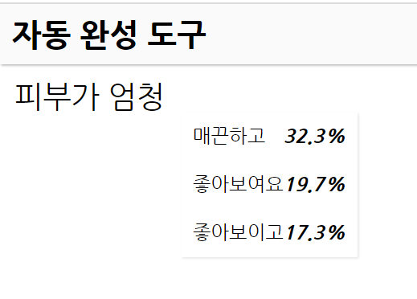

# 💄 딥러닝을 활용한 뷰티 리뷰 자동 생성기
- KDT-4기 10번째 미니 프로젝트(4인 그룹)

---
## 💻 Description

화장품을 구매한 후, 리뷰를 써야 적립금을 돌려받습니다. 
**이미 작성된 댓글을 학습**하여 내 마음에 쏙 드는 댓글을 대신 써줍니다.  

- 올리브영 베이스 메이크업 제품 판매 순위 상위 50개의 댓글 크롤링
- LSTM 딥러닝으로 다음에 올 단어를 예측하는 모델 구현
- 모델 예측 결과 확인을 위한 웹 서비스 구현(부트스트랩 활용)

---
## ⏱ Project Duration

- **개발을 위한 공부:** 2023.10.02. ~ 2023.10.13.
- **실제 개발 기간:** 2023.10.12. ~ 2023.10.13.

---
## ⚙ Environment / Prerequisite

- Python (Version 3.9.0 / Window)
- **Framework:** tensorflow, keras, Konlpy, Flask...
- **IDE:** Visual Studio Code
- **Database:** MariaDB

---
## 📁 Folders / Files

1) App / `main.py`
    - Web 서비스 실행 파일로, Blueprint의 라우팅을 담당합니다.

2) App / make_model 
    - 딥러닝 모델링을 위한 코드를 수록하였습니다.
    - `web_scraping.py` 리뷰 데이터 수집과 DB 저장
    - `data_preprocessing.py` 자연어 처리를 통한 데이터 전처리
    - `model.py` `model_test.py` LSTM 모델링과 모델 예측 결과 테스트

---
## 🔎 Usage Example
- 리뷰를 작성하고 싶은 키워드를 입력하면 다음에 올 말을 알려줍니다.  
