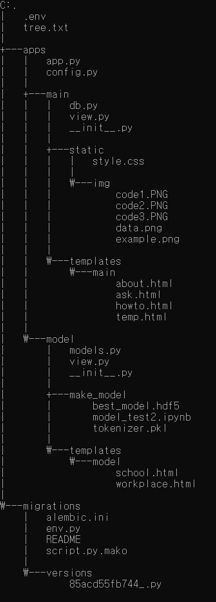

# 💢 직장 내 괴롭힘 대화 탐지 서비스
- KDT-4기 11번째 미니 프로젝트(개인 작업)

---
## 💻 Description

타인과 주고 받은 대화를 대화 창에 입력해 보세요.<br>
**직장 내 괴롭힘, 학교폭력** 등 작은 사회에서 일어나는 괴롭힘을
대화 속에서 탐지하여 알려줍니다.<br><br>

- TUNiB의 DKTC 데이터, AI-Hub의 주제별 텍스트 일상 대화 데이터를 활용
- LSTM 딥러닝으로 괴롭힘 대화 이진 분류 모델링
- 모델 실제 사용을 위한 반응형 웹 서비스 구현(부트스트랩 활용)

---
## ⏱ Project Duration

- **개발을 위한 공부:** 2023.10.16. ~ 2023.10.26.
- **실제 개발 기간:** 2023.10.20. ~ 2023.10.26.

---
## ⚙ Environment / Prerequisite

- Python (Version 3.9.0 / Window)
- **Framework:** tensorflow, keras, Konlpy, Flask...
- **IDE:** Visual Studio Code
- **Database:** MariaDB

---
## 📁 Folders / Files
- Directory Tree



1) `.env` 위치에서 명령어를 통해 서비스를 실행할 수 있습니다.
    ```cmd
    flask run
    ```

2) App / apps / `app.py`
    - Web 서비스 실행 파일입니다.
    - Web과 DB의 연결, Blueprint의 라우팅을 담당합니다.


3) App / apps / main
    - main page 기능을 구현합니다.
    - `db.py` DB Table에 데이터를 적재하기 위한 클래스를 생성합니다.
    - `view.py` main page 라우팅과 데이터 흐름을 관리합니다.

4) App / apps / model
    - 직장 내 괴롭힘 탐지 모델을 서비스합니다.
    - `models.py` 모델 예측을 위한 전처리와 예측을 수행합니다. 
    - `view.py` 모델 예측 서비스 라우팅과 데이터 흐름을 관리합니다.

---
## 🔎 Usage Example
- 직장 내에서 나눈 대화를 입력하면 직장 내 괴롭힘 대화인지 확인할 수 있습니다.<br><br>
<br><br>

- Main page에 서비스 설명, 모델링 과정을 수록하였습니다.<br>
<table>
<tr>
<td>


</td>
<td>


</td>
</tr>
</table>


